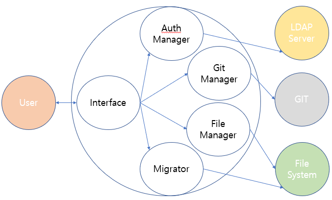

# MDWiki - MarkDown Wiki

## Introduction

This project name is MDWiki, MarkDown Wiki.

It's a python wiki engine providing confluence-like wiki system with MarkDown syntax.

## Main Features

- CRUD of content
- i18n for content
- history of wiki content
- dump, migration of content
- LDAP base authentication for page

## Product Perspective

## Interface

TBD

## Build

TBD

## Test

TBD